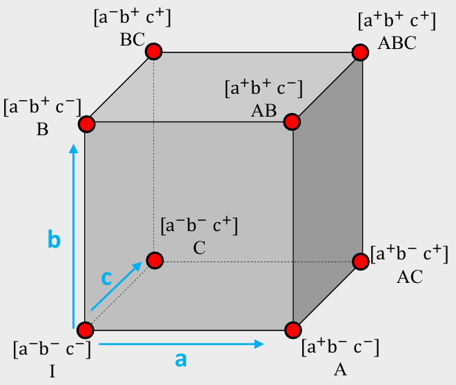

```{r setup, child="../setup.Rmd"}
```

---

class: center, middle

# Before we start, re-install {cbcTools}

.code100[

```{r, eval=FALSE}
remotes::install_github("jhelvy/cbcTools")
```

]

---

```{r child="topics/0.Rmd"}
```

---

```{r child="topics/1.Rmd"}
```

---

class: inverse, middle, center

# Main & Interaction Effects

---

background-color: #EEEDEE

# .center[Full design space for 3 effects: A, B, C]

<center>

</center>

---

background-color: #EEEDEE

# .center[Full design space for 3 effects: A, B, C]

.leftcol[

# Example: _Cars_

## A: Electric? (Yes+ or No-)
## B: Warranty? (Yes+ or No-)
## C: Ford? (Yes+ or No-)

]

.rightcol[

<center>

</center>

]

---

background-color: #EEEDEE
class: center

## Main Effects

.leftcol40[

$$
ME(a) = 
$$

$$
\left( \frac{A + AB + AC + ABC}{4}\right) - 
$$

$$
\left( \frac{I + B + C + BC}{4}\right)
$$

<br>

(A: Electric? Yes+ or No-)

]

.rightcol60[

<center>

</center>

]

---

background-color: #EEEDEE
class: center

## Interaction Effects

.leftcol[

$$
INT(ab) = 
$$

$$
\frac{1}{2}\left[ \left( \frac{AB + ABC}{2}\right) - \left( \frac{B + BC}{2}\right) \right] - 
$$

$$
\frac{1}{2}\left[ \left( \frac{A + AC}{2}\right) - \left( \frac{I + C}{2}\right) \right]
$$

]

.rightcol[

<center>

</center>

]

---

# .center[Example: Wine Pairings]

.leftcol40[

meat | wine
-----|------
fish | white 
fish | red
steak | white 
steak | red

]

--

.rightcol60[

## Main Effects

1. `meat`: **Fish** or **Steak**?
2. `wine`: **Red** or **White**?

]

---

# .center[Example: Wine Pairings]

.leftcol40[

meat | wine
-----|------
fish | white
fish | red
steak | white
steak | red

]

.rightcol60[

## Main Effects

1. `meat`: **Fish** or **Steak**?
2. `wine`: **Red** or **White**?

## Interaction Effects

1. `meat*wine`: **Red** or **White** wine _with **Steak**_?
2. `meat*wine`: **Red** or **White** wine _with **Fish**_?

]

---

class: center, middle 

# Open `interactions.qmd`

---

class: inverse, middle, center

# Fractional vs Full Factorial Designs

---

## .center[Full Factorial Design]

.leftcol[

## Example: _Cars_

## A: Electric? (Yes+ or No-)
## B: Warranty? (Yes+ or No-)
## C: Ford? (Yes+ or No-)

]

.rightcol[

```{r}
library(cbcTools)

profiles <- cbc_profiles(
    electric = c(1, 0),
    warranty = c(1, 0),
    ford     = c(1, 0)
)

profiles
```

]

---

## .center[Full Factorial Design]

.leftcol[

## Balanced?

All levels appear an equal number of times.

## Orthogonal? 

All pairs of levels appear together an equal number of times.

]

.rightcol[

```{r}
library(cbcTools)

profiles <- cbc_profiles(
    electric = c(1, 0),
    warranty = c(1, 0),
    ford     = c(1, 0)
)

profiles
```

]

---

## .center[Fractional Factorial Design]

.leftcol[

## Balanced?

All levels appear an equal number of times.

## Orthogonal? 

All pairs of levels appear together an equal number of times.

]

.rightcol[

```{r}
profiles[c(1, 3, 5, 6),]
```

]

---

class: center, middle 

# Comparing Full and Fractional Factorial Designs

# Open `balance-orthogonality.qmd`

---

class: inverse

# Practice Question 1

.leftcol[

Consider the following experiment design

a | b | c | Effect
--|---|---|-------
+ | - | - | A
- | + | - | B 
+ | - | + | AC 
- | + | + | BC 

]

.rightcol[

a) Is the design balanced? Is is orthogonal?

b) Write out the equation to compute the main effect for a, b, and c. 

c) Are any main effects confounded? If so, what are they confounded with?

]

---

```{r child="topics/2.Rmd"}
```

---

# .center[A simple conjoint experiment about _cars_]

Attribute | Levels
----------|----------
Brand     | GM, BMW, Ferrari
Price     | $20k, $40k, $100k

.center[**Design: .red[9] choice sets, .blue[3] alternatives each**]

--

.leftcol[

```
Attribute counts:

brand:
  GM   BMW  Ferrari
  10    11    6

price:

 20k  40k 100k
  9    9   9
```

]

--

.rightcol[

```
Pairwise attribute counts:

brand & price:

          20k 40k 100k
  GM        3   0    7
  BMW       4   5    2
  Ferrari   2   4    0
```

]

---

# .center[A simple conjoint experiment about _cars_]

Attribute | Levels
----------|----------
Brand     | GM, BMW, Ferrari
Price     | $20k, $40k, $100k

.center[**Design: .red[90] choice sets, .blue[3] alternatives each**]

--

.leftcol[

```
Attribute counts:

brand:
  GM    BMW   Ferrari
  92    80     98

price:

  20k  40k 100k
  91   84   95
```

]

--

.rightcol[

```
Pairwise attribute counts:

brand & price:

          20k 40k 100k
  GM      31  31  30
  BMW     25  25  30
  Ferrari 35  28  35
```

]

---

# .center[Bayesian D-efficient designs]

### .center[Maximize information on "Main Effects" according to priors]

--

Attribute | Levels | Prior
----------|-------------------|----------
Brand     | GM, BMW, Ferrari  | 0, 1, 2
Price     | $20k, $40k, $100k | 0, -1, -4

$$v_j = 1 \delta^{\mathrm{BMW}} + 2 \delta^{\mathrm{Ferrari}} -1 \delta^{\mathrm{40k}} -4 \delta^{\mathrm{100k}}$$ 

---

# .center[Bayesian D-efficient designs]

### .center[Maximize information on "Main Effects" according to priors]


Attribute | Levels | Prior
----------|-------------------|----------
Brand     | GM, BMW, Ferrari  | 0, 1, 2
Price     | $20k, $40k, $100k | 0, -1, -4

.leftcol[

```
Attribute counts:

brand:
  GM    BMW   Ferrari
  93    90     86

price:

  20k  40k 100k
  97   93   78
```

]

--

.rightcol[

```
Pairwise attribute counts:

brand & price:

          20k 40k 100k
  GM      52  41  0
  BMW     30  30  30
  Ferrari 15  22  49
```

]

---

class: center 

### Negative of the hessian evaluated at a set of parameters is called the **"Information Matrix"**

## $$\boldsymbol{I}(\boldsymbol{\beta}) = - \nabla_{\boldsymbol{\beta}}^2 \ln (\mathcal{L})$$

---

class: center

## "D-optimal" designs attempt to minimize the<br>"D-error" of a design

## $$D = |\boldsymbol{I}(\boldsymbol{\beta})| ^{-1/p}$$

where $p$ is the number of coefficients in the model

---

class: center, middle 

# Finding Efficient Designs

# Open `design-efficiency.qmd`

---

class: inverse

```{r, echo=FALSE}
countdown(
  minutes = 20,
  warn_when = 15,
  update_every = 1,
  top = 0,
  right = 0,
  font_size = '2em'
)
```

## Your Turn

1. Individually, create a Bayesian D-efficient fractional factorial survey design. Inspect the attribute balance and overlap. 

2. Compare your results with your teammates.

---

class: inverse

# Quiz 4

```{r, echo=FALSE}
countdown(
    minutes = 10,
    warn_when = 30,
    update_every = 1,
    bottom = 0,
    left = 0,
    font_size = '4em'
)
```

.leftcol[

### Link is in the #class channel

]

.rightcol[

<center>

</center>

]

---

```{r child="topics/3.Rmd"}
```

---

class: center, middle 

# How many respondents do I need?

---

class: center, middle 

# How many respondents do I need<br>_to get X level of precision on $\boldsymbol{\beta}$_?

---

# Standard errors are inversely related to $\sqrt{N}$

.leftcol[

```{r uncertainty, fig.show='hide'}
n <- seq(100)
se <- 1/sqrt(n)
plot(n, se, type = "l")
```

Standard errors also decrease with:

- Fewer attributes
- Fewer levels in each categorical attribute
- More questions per respondent

]

.rightcol[

```{r, ref.label="uncertainty", echo=FALSE, fig.height=4.5, fig.width=6}
```

]

---

class: center, middle 

## Using {cbcTools}, we can run simulations to determine the necessary sample size for a specific model

# Open `powerAnalysis.qmd`

---

class: inverse

```{r, echo=FALSE}
countdown(
  minutes = 20,
  warn_when = 15,
  update_every = 1,
  top = 0,
  right = 0,
  font_size = '2em'
)
```

## Your Turn

.leftcol80[

Individually: 

1. Using the survey design you created in the last practice, conduct a power analysis to determine the necessary sample size to achieve a 0.05 significance level on your parameter estimates.

2. Compare your results with your teammates.

]
