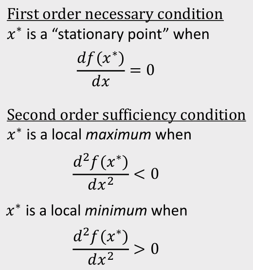
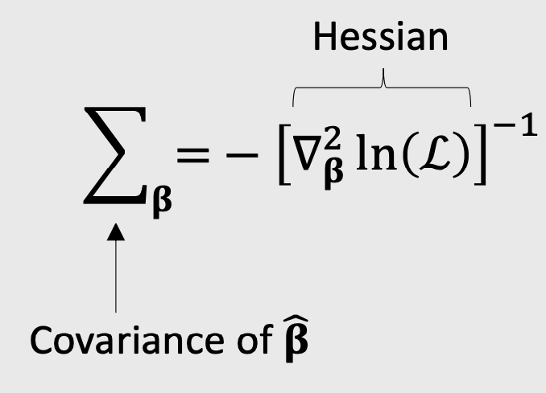
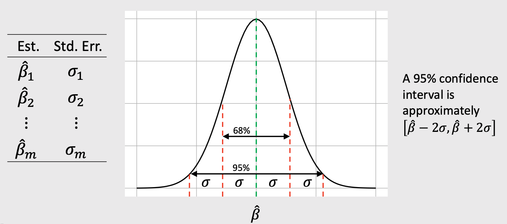

```{r setup, child="../setup.Rmd"}
```

---

class: middle 

.leftcol[

# .center[Analysis]

## 1. Clean data 
## 2. Modeling

- Simple logit
- Mixed logit
- One sub-group model

## 3. Analysis

- WTP for key features
- Market simulation
- Sensitivity analysis

]

--

.rightcol[

# .center[Report]

## 1. Introduction
## 2. Survey Design
## 3. Data Analysis
## 4. Results (plots / text)
## 5. Recommendations

]

---

# Final Presentation 

## - In class, 12/11 (6:10 - 8:40)

--

## - 10 minutes (strict)

--

## - Slides due on Blackboard by midnight on 12/10

---

```{r child="topics/0.Rmd"}
```

---

```{r child="topics/1.Rmd"}
```

---

.leftcol[

## .center[Things I'm covering]

- Data wrangling in R 
- Utility models 
- Maximum likelihood estimation
- Optimization
- Uncertainty 
- Design of experiment
- WTP 
- Market simulations
- Sub-group models
- Using R for all of the above<br>(e.g., estimating models with `logitr`)

]

--

.rightcol[

## .center[Things I'm **not** covering]

- surveydown
- Mixed logit

]

---

class: inverse, middle, center 

# Data wrangling in R

---

# Steps to importing external data files

## 1. Create a path to the data

```{r}
library(here)
path_to_data <- here('data', 'data.csv') #<<
path_to_data
```

--

## 2. Import the data

```{r, eval=FALSE}
library(tidyverse)
data <- read_csv(path_to_data) #<<
```

---

# Steps to importing external data files

```{r, eval=FALSE}
library(tidyverse)

data <- read_csv(here::here('data', 'data.csv'))
```

---

# .center[The main `dplyr` "verbs"]

<br>

"Verb"        | What it does
--------------|--------------------
`select()`    | Select columns by name
`filter()`    | Keep rows that match criteria
`arrange()`   | Sort rows based on column(s)
`mutate()`    | Create new columns 

---

# Example data frame

```{r}
beatles <- tibble(
    firstName   = c("John", "Paul", "Ringo", "George"),
    lastName    = c("Lennon", "McCartney", "Starr", "Harrison"),
    instrument  = c("guitar", "bass", "drums", "guitar"),
    yearOfBirth = c(1940, 1942, 1940, 1943),
    deceased    = c(TRUE, FALSE, FALSE, TRUE)
)

beatles
```

---

# `filter()` and `select()`:

Get the **first & last name** of members born after 1941 & are still living

```{r}
beatles %>% 
  filter(yearOfBirth > 1941, deceased == FALSE) %>% 
  select(firstName, lastName)
```

---

# Create new variables with `mutate()`

Use the `yearOfBirth` variable to compute the age of each band member

```{r}
beatles %>%
    mutate(age = 2022 - yearOfBirth) %>%
    arrange(age)
```

---

# .center[Handling if/else conditions]

### .center[`ifelse(<condition>, <if TRUE>, <else>)`]

```{r}
beatles %>%
    mutate(playsGuitar = ifelse(instrument == "guitar", TRUE, FALSE))
```

---

class: inverse, center, middle

# Utility models 

---

class: center 

# Random utility model 

<br>

## The utility for alternative $j$ is
# $$\tilde{u}_j = v_j + \tilde{\varepsilon}_j$$

## $v_j$ = Things we observe (non-random variables)
## $\tilde{\varepsilon}_j$ = Things we _don't_ observe (random variable)

---

class: center

## **Logit model**: Assume that $\tilde{\varepsilon}_j$ ~ [Gumbel Distribution](https://en.wikipedia.org/wiki/Gumbel_distribution)

.leftcol[

## $$\tilde{u}_j = v_j + \tilde{\varepsilon}_j$$

<center>

</center>

]

.rightcol[

## Probability of choosing alternative $j$: 

# $$P_j = \frac{e^{v_j}}{\sum_k{e^{v_k}}}$$

]

---

#.center[Notation Convention]

.leftcol[

## Continuous: $x_j$

## $$u_j = \beta_1 x_{j}^{\mathrm{price}} + \dots$$

```{r, echo=FALSE}
data.frame(price = c(1, 2, 3))
```

]

.rightcol[

## Discrete: $\delta_j$

## $$u_j = \beta_1 \delta_{j}^{\mathrm{ford}} + \beta_2 \delta_{j}^{\mathrm{gm}} \dots$$

```{r, echo=FALSE}
fastDummies::dummy_cols(data.frame(brand = c("Ford", "GM", "BMW")))
```

]

---

# .center[Dummy-coded variables]

.center[**Dummy coding**: 1 = "Yes", 0 = "No"]

--

.leftcol[

Data frame with one variable: _brand_

```{r}
data <- data.frame(
    brand = c("Ford", "GM", "BMW"))

data
```

]

--

.rightcol[

Add dummy columns for each brand

```{r}
library(fastDummies)

dummy_cols(data, "brand")
```

]

---

.leftcol[

.center[

### Modeling _continuous_ variable

$v_j = \beta_1 x^\mathrm{price}$

]

```{r, eval=FALSE}
model <- logitr(
    data   = data,
    choice = "choice",
    obsID  = "obsID",
    pars   = "price"
)
```

<br>

Coef. | Interpretation
------|------------------
β1 | how utility changes with increasing _price_

]

--

.rightcol[

.center[

### Modeling _discrete_ variable

$v_j = \beta_1 \delta_{j}^{\mathrm{ford}} + \beta_2 \delta_{j}^{\mathrm{gm}}$

]

```{r, eval=FALSE}
model <- logitr(
    data   = data,
    choice = "choice",
    obsID  = "obsID",
    pars   = c("brand_Ford", "brand_GM")
)
```

.center[Reference level: _BMW_]

Coef. | Interpretation
------|------------------
β1 | utility for _Ford_ relative to _BMW_
β2 | utility for _GM_ relative to _BMW_

]

---

# .center[Estimating utility models]

<br>

.rightcol80[

## 1. Open `logitr-cars.Rproj`

## 2. Open `code/3.1-model-mnl.R`

]

---

.leftcol[

# `mnl_dummy`

All discrete (dummy-code) variables 
```{r, eval=FALSE}
pars = c(
  "price_20", "price_25",
  "fuelEconomy_25", "fuelEconomy_30",
  "accelTime_7", "accelTime_8",
  "powertrain_Electric")
```

Reference Levels:

- Price: 15
- Fuel Economy: 20
- Accel. Time: 6
- Powertrain: "Gasoline"

]

--

.rightcol[

# `mnl_linear`

All continuous (linear), except for `powertrain_Electric` 
```{r, eval=FALSE}
pars = c(
  'price', 'fuelEconomy', 'accelTime', 
  'powertrain_Electric')
```

Reference Levels:

- Powertrain: "Gasoline"

]

---

class: inverse

# Practice Question 1

.leftcol[

Let's say our utility function is:

.font80[$$v_j = \beta_1 x_j^{\mathrm{price}} + \beta_2 x_j^{\mathrm{cacao}} + \beta_3 \delta_j^{\mathrm{hershey}} + \beta_4 \delta_j^{\mathrm{lindt}}$$]

And we estimate the following coefficients:

Parameter | Coefficient 
----------|-----------
$\beta_1$ | -0.1
$\beta_2$ | 0.1
$\beta_3$ | -2.0
$\beta_4$ | -0.1

]

.rightcol[

What are the expected probabilities of choosing each of these bars using a logit model? 

```{r, echo=FALSE}
tibble(
  Attribute = c("Price", "% Cacao", "Brand"),
  `Bar 1` = c("$1.20", "10%", "Hershey"),
  `Bar 2` = c("$1.50", "60%", "Lindt"),
  `Bar 3` = c("$3.00", "80%", "Ghirardelli"),
) %>%
  kable() %>% 
  kable_styling(
      bootstrap_options = c("hover", "condensed"), 
      full_width = FALSE
  ) %>% 
  row_spec(0:3, color = "white")
```

]

---

class: inverse, center, middle

# Maximum likelihood estimation

---

background-color: #EEEDEE

# Maximum likelihood estimation

<center>

</center>

---

background-color: #EEEDEE

## .center[Computing the likelihood]

.leftcol[

<center>

</center>

]

.rightcol[

$x$: an observation

$f(x)$: probability of observing $x$

]

---

background-color: #EEEDEE

## .center[Computing the likelihood]

.leftcol[

<center>

</center>

]

.rightcol[

$x$: an observation

$f(x)$: probability of observing $x$

$\mathcal{L}(\theta | x)$: probability that $\theta$ are the true parameters, given that observed $x$

$\mathcal{L}(\theta | x) = f(x_1) f(x_2) \dots f(x_n)$

Log-likelihood converts multiplication to summation:

$\ln \mathcal{L}(\theta | x) = \ln f(x_1) + \ln f(x_2) \dots \ln f(x_n)$

]

---

class: inverse

# Practice Question 2

**Observations** - Height of students (inches):

```{r, echo=FALSE}
x <- c(65, 69, 66, 67, 68, 72, 68, 69, 63, 70)
x
```

a) Let's say we know that the height of students, $\tilde{x}$, in a classroom follows a normal distribution. A professor obtains the above height measurements students in her classroom. What is the log-likelihood that $\tilde{x} \sim \mathcal{N} (68, 4)$? In other words, compute $\ln \mathcal{L} (\mu = 68, \sigma = 4)$.

b) Compute the log-likelihood function using the same standard deviation $(\sigma = 4)$ but with the following different values for the mean, $\mu: 66, 67, 68, 69, 70$. How do the results compare? Which value for $\mu$ produces the highest log-likelihood?

---

class: inverse, center, middle

# Optimization

---

background-color: #EEEDEE
class: center, middle 

## Optimality conditions

.leftcol40[

<center>

</center>

]

.rightcol60[

<center>

</center>

]

---

background-color: #EEEDEE

class: center, middle 

<center>

</center>

---

class: inverse, center, middle

# Uncertainty

---

background-color: #EEEDEE

<center>

</center>

---

background-color: #EEEDEE

class: middle, center

## The _curvature_ of the log-likelihood function is<br>inversely related to the hessian

<center>

</center>

---

background-color: #EEEDEE
class: middle, center

## The _curvature_ of the log-likelihood function is<br>inversely related to the hessian

<center>

</center>

---

background-color: #EEEDEE
class: middle, center

### Usually report parameter uncertainty ("standard errors") with $\sigma$ values

<center>

</center>

---

## .center[Two approaches for obtaining confidence interval]

## Using Standard Errors

1. Get coefficients, `beta`
2. Get covariance matrix, `covariance` 
3. `se <- sqrt(diag(covariance))`
4. `coef_ci <- c(beta - 2*se, beta + 2*se)`

## Using Simulated Draws

1. Get coefficients, `beta`
2. Get covariance matrix, `covariance`  
3. `draws <- as.data.frame(MASS::mvrnorm(10^5, beta, covariance))`
4. `coef_ci <- logitr::ci(draws, ci = 0.95)`

---

.leftcol[

## In-class example

```{r, eval=FALSE}
# 1. Get coefficients
beta <- c(
    price = -0.7, mpg = 0.1, elec = -4.0)

# 2. Get covariance matrix
hessian <- matrix(c(
    -6000,   50,   60,
       50, -700,   50,
       60,   50, -300),
    ncol = 3, byrow = TRUE)

covariance <- -1*solve(hessian)
```

]

.rightcol[

## Model from `logitr`

```{r, eval=FALSE}
beta <- coef(model)
covariance <- vcov(model)
```

]

---

class: inverse

# Practice Question 3

.leftcol[

Suppose we estimate the following utility model describing preferences for cars:

$$
u_j = \alpha p_j + \beta_1 x_j^{mpg} + \beta_2 x_j^{elec} + \varepsilon_j
$$

Compute a 95% confidence interval around the coefficients using:

a) Standard errors 
b) Simulated draws

]

.rightcol[

The estimated model produces the following results:

Parameter | Coefficient
----------|------------
$\alpha$ | -0.7
$\beta_1$ | 0.1
$\beta_2$ | -0.4

Hessian:

$$
\begin{bmatrix}
-6000 & 50 & 60
\\ 
50 & -700 & 50
\\
60 & 50 & -300
\end{bmatrix}
$$

]

---

class: inverse, center, middle

# Design of experiment

---

# .center[Wine Pairings Example]

.leftcol40[

meat | wine
-----|------
fish | white 
fish | red
steak | white 
steak | red

]

--

.rightcol60[

## Main Effects

1. **Fish** or **Steak**?
2. **Red** or **White** wine?

## Interaction Effects

1. **Red** or **White** wine _with **Steak**_?
2. **Red** or **White** wine _with **Fish**_?

]

---

class: center

## "D-optimal" designs maximize **main** effect information<br>but confound **interaction** effect information

## $$D = \left( \frac{|\boldsymbol{I}(\boldsymbol{\beta})|}{n^p} \right)^{1/p}$$

where $p$ is the number of coefficients in the model and $n$ is the total sample size

---

class: inverse, center, middle

# WTP 

---

class: center 

## Willingness to Pay (WTP)

<br>

## $$\tilde{u}_j = \alpha p_j + \boldsymbol{\beta} x_j + \tilde{\varepsilon_j}$$

<br>

## $$\boldsymbol{\omega} = \frac{\boldsymbol{\beta}}{-\alpha}$$

---

# .center[Computing WTP with draws]

## $$\hat{\boldsymbol{\omega}} = \frac{\hat{\boldsymbol{\beta}}}{-\hat{\alpha}}$$

```{r, echo=FALSE}
beta <- c(-0.7, 0.1, -4.0)
hessian <- matrix(c(
    -6000,   50,   60,
       50, -700,   50,
       60,   50, -300),
    ncol = 3, byrow = TRUE)
covariance <- -1*solve(hessian)
draws <- MASS::mvrnorm(10^4, beta, covariance)
```

.leftcol55[

```{r}
draws_other <- draws[,2:ncol(draws)]
draws_price <- draws[,1]
draws_wtp <- draws_other / (-1*draws_price)
head(draws_wtp)
```

]

.rightcol45[

Mean WTP with confidence interval
```{r}
logitr::ci(draws_wtp)
```

]

---

class: center 

## Willingness to Pay (WTP)

.leftcol[

## "Preference Space"

## $$\tilde{u}_j = \alpha p_j + \boldsymbol{\beta} x_j + \tilde{\varepsilon_j}$$

]

--

.rightcol[

## "WTP Space"

## $$\boldsymbol{\omega} = \frac{\boldsymbol{\beta}}{-\alpha}$$
## $$\lambda = - \alpha$$
## $$\tilde{u}_j = \lambda (\boldsymbol{\omega} x_j - p_j) + \tilde{\varepsilon_j}$$

]

---

class: center 

# WTP space models have non-convex<br>log-likelihood functions!

--

<br>

# **Use multi-start loop with<br>random starting points**

---

class: inverse, center, middle

# Market simulations

---

# .center[Simulate Market Shares]

## 1. Define a market, $X$

## 2. Compute shares:

## $$\hat{P}_j = \frac{e^{\hat{\boldsymbol{\beta}}'\boldsymbol{X}_j}}{\sum_{k=1}^J e^{\hat{\boldsymbol{\beta}}'\boldsymbol{X}_k}}$$

---

background-color: #EEEDEE

# .center[Simulate Market Shares]

<center>

</center>

---

background-color: #EEEDEE

# .center[Simulate Market Shares]

.leftcol70[

<center>

</center>

]

.rightcol30[

In R:
```{r, eval=FALSE}
X %*% beta
```

]

---

# .center[Simulating Market Shares **with Uncertainty**]

Rely on the `predict()` function to compute shares with uncertainty. 

Internally, it:

1. Takes draws of $\boldsymbol{\beta}$
2. Computes $P_j$ for each draw 
3. Returns mean and confidence interval computed from draws

---

class: center, middle

# Review the `logitr-cars` examples

---

class: inverse, center

# .fancy[Break]

```{r, echo=FALSE}

countdown(
    minutes      = 5,
    warn_when    = 30,
    update_every = 1,
    left         = 0, right = 0, top = 1, bottom = 0,
    margin       = "5%",
    font_size    = "8em"
)
```

---

```{r child="topics/2.Rmd"}
```

---

.leftcol[

### .center[**Market share** sensitivity to price]

<center>

</center>

]

--

.rightcol[

### .center[**Revenue** sensitivity to price]

<center>

</center>
$$R = Q*P$$

]

---

.leftcol[

### .center[**Market share** sensitivity to price]

<center>

</center>

]

.rightcol[

### .center[**Observations**]

- Solid line reflects _interpolation_ (attribute range in survey)
- Dashed line reflects _extrapolation_ (beyond attribute range in survey)
- Ribbon reflects _parameter uncertainty_

]

---

## .center[Market share sensitivity to all attributes]

<center>

</center>

---

.leftcol[

### .center[Market share sensitivity to all attributes]

<center>

</center>

]

.rightcol[

### .center[**Observations**]

- Middle point reflects baseline market share: 
    - **Price**: $25,000 
    - **Fuel Economy**: 100 mpg 
    - **0-60 mph Accel. time**: 6 sec
    
- Boundaries on each attribute should reflect max feasible attribute bounds

]

---

# .center[Sensitivity analyses]

<br>

## 1. Open `logitr-cars`

## 2. Open `code/9.1-compute-sensitivity.R`
## 3. Open `code/9.2-plot-sensitivity.R`


---

class: inverse

```{r, echo=FALSE}
countdown(
  minutes = 15,
  warn_when = 15,
  update_every = 1,
  top = 0,
  right = 0,
  font_size = '2em'
)
```

## Your Turn

### As a team: 

.leftcol80[.font120[

- Read in and clean your final data. 
- Estimate a baseline model. 
- Set your baseline market simulation case. 
- Compute sensitivities to price and other attributes. 

]]
 