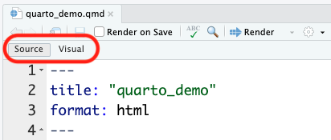
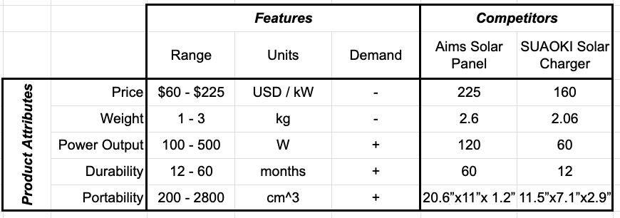

```{r setup, child="../setup.Rmd"}
```

```{r}
#| include: false

# For this class
data <- mtcars
bears <- read_csv(here::here('data', 'bear_killings.csv'))
theme_set(theme_gray(base_size = 16))
```

---

class: inverse

# Quiz 1

```{r, echo=FALSE}
countdown(
    minutes = 10,
    warn_when = 30,
    update_every = 1,
    bottom = 0,
    left = 0,
    font_size = '4em'
)
```

.leftcol[

### Download the template from the #class channel

### Make sure you unzip it!

### When done, submit your `quiz1.qmd` on Blackboard

]

.rightcol[

<center>

</center>

]

---

```{r child="topics/0.Rmd"}
```

---

```{r child="topics/1.Rmd"}
```

---

class: center

# "Literate programming"

.leftcol[.left[

> ### Treat programs as a "literature" understandable to **human beings**

]]

.rightcol[.center[

<center>

</center>

[Donald E. Knuth](https://en.wikipedia.org/wiki/Donald_Knuth)

]]

---


class: middle, inverse

# .center[Quick demo]

<br>

# 1. Open `quarto_demo.qmd`

# 2. Click "Render"

<center>

</center>

---

# .center[Anatomy of a .qmd file]

<br>

# .red[Header]

# Markdown text

# R code

---

# Define overall document options in header

.leftcol[

Basic html page

```
---
title: Your title
author: Author name
format: html
---
```

]

.rightcol[

Add table of contents, change theme

```
---
title: Your title
author: Author name
toc: true
format:
  html:
    theme: united
---
```

More on themes at https://quarto.org/docs/output-formats/html-themes.html

]

---

# Render to multiple outputs

.leftcol[

### PDF uses LaTeX

```
---
title: Your title
author: Author name
format: pdf
---
```

If you don't have LaTeX on your computer, install tinytex in R:

```{r}
#| eval: false

tinytex::install_tinytex()
```

]

.rightcol[

### Microsoft Word

```
---
title: Your title
author: Author name
format: docx
---
```

]

---

# .center[Anatomy of a .qmd file]

<br>

# ~~Header~~

# .red[Markdown text]

# R code

---

class: center

# Right now, bookmark this! `r emo::ji("point_down")`

# https://commonmark.org/help/

<br><hr><br>

# (When you have 10 minutes, do this! `r emo::ji("point_down")`)

# https://commonmark.org/help/tutorial/

---

# .center[Headers]

--

.leftcol[

```markdown
# HEADER 1

## HEADER 2

### HEADER 3

#### HEADER 4

##### HEADER 5

###### HEADER 6
```

]

--

.rightcol[

# HEADER 1

## HEADER 2

### HEADER 3

#### HEADER 4

##### HEADER 5

###### HEADER 6

]

---

# .center[Basic Text Formatting]

.leftcol[

## Type this...

- `normal text`
- `_italic text_`
- `*italic text*`
- `**bold text**`
- `***bold italic text***`
- `~~strikethrough~~`
- `` `code text` ``

]

.rightcol[

## ..to get this

- normal text
- _italic text_
- *italic text*
- **bold text**
- ***bold italic text***
- ~~strikethrough~~
- `code text`

]

---

class: top

# .center[Lists]

.leftcol[

Bullet list:

```{r, eval=FALSE}
- first item
- second item
- third item
```

- first item
- second item
- third item

]

.rightcol[

Numbered list:

```{r, eval=FALSE}
1. first item
2. second item
3. third item
```

1. first item
2. second item
3. third item

]

---

# .center[Links]

Simple **url link** to another site:

```{r, eval=FALSE}
[Download R](http://www.r-project.org/)
```

[Download R](http://www.r-project.org/)

---

class: middle, center

# Don't want to use Markdown?

# .red[Use Visual Mode!]

<center>

</center>

---

# .center[Anatomy of a .qmd file]

<br>

# ~~Header (think of this as the "settings")~~

# ~~Markdown text~~

# .red[R code]

---

class: center

# R Code

--

.leftcol[

## Inline code

.left[
```{r, eval=FALSE}
`r insert code here`
```

]]

--

.rightcol[

## Code chunks

.left[

````markdown
`r ''````{r}
insert code here
insert more code here
```
````

]]

---

# Inline R code

```{r, eval=FALSE}
The sum of 3 and 4 is `r 3 + 4`
```

--

Produces this:

The sum of 3 and 4 is `r 3 + 4`

---

# R Code chunks

.leftcol[

This code chunk...

````markdown
`r ''````{r}
library(palmerpenguins)

head(penguins)
```
````

]

--

.rightcol[

...will produce this when compiled:

```{r}
library(palmerpenguins)

head(penguins)
```

]

---

# Chunk options

Control what chunks output using options

All options [here](https://quarto.org/docs/reference/cells/cells-knitr.html)

```{r, echo=FALSE, out.width='60%'}
knitr::include_graphics('images/chunks_options.png')
```

---

# .center[Chunk output options]

.center[By default, code chunks print **code** + **output**]

--

.cols3[

````markdown
`r ''````{r}
#| echo: false

cat('hello world!')
```
````

Prints only **output**<br>(doesn't show code)

```{r}
#| echo: false

cat('hello world!')
```

]

--

.cols3[

````markdown
`r ''````{r}
#| eval: false

cat('hello world!')
```
````

Prints only **code**<br>(doesn't run the code)

```{r}
#| eval: false

cat('hello world!')
```

]

--

.cols3[

````markdown
`r ''````{r}
#| include: false

cat('hello world!')
```
````

Runs, but doesn't print anything

```{r}
#| include: false

cat('hello world!')
```

]

---

# message / warning


---

# message / warning

Drop messages and warnings in chunk settings

.leftcol[

````markdown
`r ''````{r}
#| message: false
#| warning: false

library(tidyverse)
```
````

]

---

# A global `setup` chunk 🌍

.leftcol[

````markdown
`r ''````{r}
#| label: setup
#| include: false

knitr::opts_chunk$set(
    warning = FALSE,
    message = FALSE,
    fig.path = "figs/",
    fig.width = 7.252,
    fig.height = 4,
    comment = "#>",
    fig.retina = 3
)
```
````

]

.rightcol[

- Typically the first chunk
- All following chunks will use these options (i.e., sets global chunk options)
- You can (and should) use individual chunk options too
- Often where I load libraries, etc.

]

---

class: inverse

```{r, echo=FALSE}
countdown(
    minutes = 15,
    warn_when = 15,
    update_every = 1,
    top = 0,
    right = 0,
    font_size = '2em'
)
```

# Your turn

.font90[

1) Open the `bears.qmd` file, and title it _"Bears Analysis"_

2) Create a "setup" code chunk to read in the `bear_killings.csv` data file<br>(HINT: You might want to look back at the `quarto_demo.qmd` file!).

3) Use text and code to find answers each of the following questions - show your code and results to justify each answer:

- Which months have the highest frequency of bear killings?
- Who has been killed more often by bears: hunters or hikers?
- How do the the number of bear attacks on men vs women compare?

HINT: Use `bears %>% count(variable)` to count how many rows are in the data for each unique value of `variable`

]

---

```{r child="topics/2.Rmd"}
```

---

.leftcol[


]

.rightcol[

# "Grammar of Graphics"

Concept developed by Leland Wilkinson (1999)

**ggplot2** package developed by Hadley Wickham (2005)

]

---

# Making plot layers with ggplot2

<br>

### 1. The data 
### 2. The aesthetic mapping (what goes on the axes?)
### 3. The geometries (points? bars? etc.)
### 4. The annotations / labels
### 5. The theme

---

# Layer 1: The data

```{r}
head(mpg)
```

---

# Layer 1: The data

The `ggplot()` function initializes the plot with whatever data you're using

.leftcol[

```{r ggblank, fig.show='hide'}
mpg %>% 
  ggplot()
```

]

.rightcol[.blackborder[

```{r ref.label='ggblank', echo=FALSE, fig.height=5, fig.width=7}
```

]]

---

# Layer 2: The aesthetic mapping

The `aes()` function determines which variables will be _mapped_ to the geometries<br>(e.g. the axes)

.leftcol[

```{r ggaes, fig.show='hide'}
mpg %>% 
  ggplot(aes(x = displ, y = hwy)) #<<
```

]

.rightcol[.blackborder[

```{r ref.label='ggaes', echo=FALSE, fig.height=5, fig.width=7}
```

]]

---

# Layer 3: The geometries

Use `+` to add geometries, e.g. `geom_points()` for points

.leftcol[

```{r ggpoint, fig.show='hide'}
mpg %>% 
  ggplot(aes(x = displ, y = hwy)) +
  geom_point() #<<
```

]

.rightcol[.blackborder[

```{r ref.label='ggpoint', echo=FALSE, fig.height=5, fig.width=7}
```

]]

---

# Layer 4: The annotations / labels

Use `labs()` to modify most labels

.leftcol[

```{r gglabs, fig.show='hide'}
mpg %>% 
  ggplot(aes(x = displ, y = hwy)) +
  geom_point() +
  labs( #<<
    x = "Engine displacement (liters)",  #<<
    y = "Highway fuel economy (mpg)",  #<<
    title = "Most larger engine vehicles are less fuel efficient" #<<
  ) #<<
```

]

.rightcol[

```{r ref.label='gglabs', echo=FALSE, fig.height=5, fig.width=7}
```

]

---

# Layer 5: The theme

.leftcol[

```{r ggtheme_bw, fig.show='hide'}
mpg %>% 
  ggplot(aes(x = displ, y = hwy)) +
  geom_point() +
  labs(
    x = "Engine displacement (liters)",  
    y = "Highway fuel economy (mpg)", 
    title = "Most larger engine vehicles are less fuel efficient"
  ) + 
  theme_bw() #<<
```

]


.rightcol[

```{r ref.label='ggtheme_bw', echo=FALSE, fig.height=5, fig.width=7}
```

]

---

### Common themes

.leftcol[

`theme_bw()`

```{r, fig.height=4, fig.width=6}
mpg %>% 
  ggplot(aes(x = displ, y = hwy)) +
  geom_point() +
  theme_bw() #<<
```

]

.rightcol[

`theme_minimal()`

```{r, fig.height=4, fig.width=6}
mpg %>% 
  ggplot(aes(x = displ, y = hwy)) +
  geom_point() +
  theme_minimal() #<<
```

]

---

### Common themes

.leftcol[

`theme_classic()`

```{r, fig.height=4, fig.width=6}
mpg %>% 
  ggplot(aes(x = displ, y = hwy)) +
  geom_point() +
  theme_classic() #<<
```

]

.rightcol[

`theme_void()`

```{r, fig.height=4, fig.width=6}
mpg %>% 
  ggplot(aes(x = displ, y = hwy)) +
  geom_point() +
  theme_void() #<<
```

]

---

### Other themes: [hrbrthemes](https://github.com/hrbrmstr/hrbrthemes)

```{r, eval=FALSE}
remotes::install_github("hrbrmstr/hrbrthemes")
```

.leftcol[

```{r, fig.height=4, fig.width=6}
mpg %>% 
  ggplot(aes(x = displ, y = hwy)) +
  geom_point() +
  hrbrthemes::theme_ipsum() #<<
```

]

.rightcol[

```{r, fig.height=4, fig.width=6}
mpg %>% 
  ggplot(aes(x = displ, y = hwy)) +
  geom_point() +
  hrbrthemes::theme_ft_rc() #<<
```

]

---

### Other themes: [ggthemes](https://jrnold.github.io/ggthemes/)

```{r, eval=FALSE}
install.packages('ggthemes', dependencies = TRUE)
```

.leftcol[

```{r, fig.height=4, fig.width=6}
mpg %>% 
  ggplot(aes(x = displ, y = hwy)) +
  geom_point() +
  ggthemes::theme_economist() #<<
```

]

.rightcol[

```{r, fig.height=4, fig.width=6}
mpg %>% 
  ggplot(aes(x = displ, y = hwy)) +
  geom_point() +
  ggthemes::theme_economist_white() #<<
```

]

---

class: center, middle, inverse 

# More practice

# Open `ggplot2.qmd`

---

class: middle, inverse 

.leftcol[

```{r}
#| echo: false

mpg %>% 
  ggplot() +
  geom_smooth(aes(x = displ, y = hwy, color = drv))
```

```{r}
#| echo: false

mpg %>% 
  count(class, drv) %>% 
  ggplot() +
  geom_col(aes(x = drv, y = n, fill = class), width = 0.7)
```

]

.rightcol[

```{r, echo=FALSE}
countdown(
    minutes = 15,
    warn_when = 15,
    update_every = 1,
    top = 0,
    right = 0,
    font_size = '2em'
)
```

## Your turn

Open `practice.qmd`

Use the `mpg` data frame and ggplot to create these charts

```{r}
#| echo: false

mpg %>% 
  ggplot(aes(x = displ, y = hwy)) +
  geom_point(aes(color = class)) + 
  geom_smooth(se = FALSE)
```

]

---

class: inverse

# Extra practice

.leftcol[

```{r, ggbar_p1, echo=FALSE, fig.height=5, fig.width=7}
bears %>%
  count(year, gender) %>%
  ggplot() +
  geom_col(aes(x = year, y = n, fill = gender)) +
  labs(
    x     = "Year",
    y     = 'Number of killings',
    fill  = "Victim gender",
    title = "Annual deadly bear attacks over time"
  ) +
  theme_bw()
```

]

.rightcol[

```{r, fig.height=4, fig.width=6, echo=FALSE}
mpg %>%
    mutate(manufacturer = str_to_title(manufacturer)) %>%
    group_by(manufacturer) %>%
    summarise(mean_hwy = mean(hwy)) %>%
    ggplot() +
    geom_col(
      aes(x = mean_hwy, y = reorder(manufacturer, mean_hwy)), 
      width = 0.9) +
    labs(
      x = 'Highway fuel economy (mpg)',
      y = 'Vehicle manufacturer', 
      title = 'Mean fuel economy by automaker'
    ) + 
    theme_minimal()
```

]

---

```{r child="topics/3.Rmd"}
```

---

class: center

# Model Relationships Table ([example](https://docs.google.com/spreadsheets/d/1Hmxfav_l1bubnaPkIiiMW0tZrFA-xblP9_ndN_6TB1I/edit?usp=sharing))

.border[

<center>

</center>

]

## Start defining attribute _levels_

---

# Defining attribute levels

.leftcol[

## Continuous

- **Price**: 1, 2, 3, 4, 5 ($)
- **Power Output**: 60, 80, 120 (Watts)

## Discrete

- **Color**: Red, Blue, Yellow
- **Material**: Plastic, Aluminum, Glass

]

.rightcol[

- Look at competitors
- Search web for values that cover the full set of values available today (and maybe some into the future)

]
