```{r setup, child="../setup.Rmd"}
```

```{r}
#| echo: false

library(surveydown)
```

---

class: inverse, middle

# .center[**Reminders**]

# Proposals due Sunday, 9/22 by midnight

--

<br>

# Next week project workshop:<br>team meetings & proposal feedback

---

```{r child="topics/0.Rmd"}
```

---

```{r child="topics/1.Rmd"}
```

---

class: middle 

# 1. Open `demoSurvey.Rproj`

# 2. Open `demoSurvey.qmd`

# 3. Click "Run Document"

---

.leftcol[

# Four parts to a surveydown survey

1. The YAML header
2. The setup code chunk
3. The survey body
4. The server code chunk

]

.rightcol[

<center>
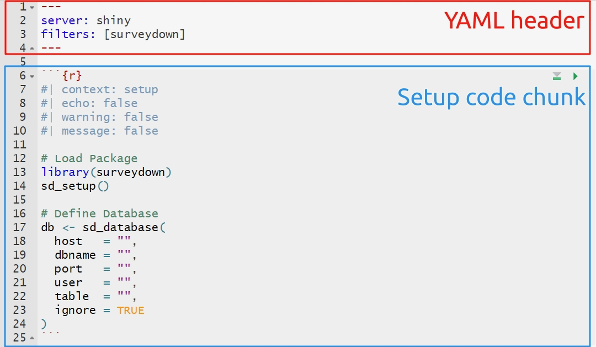
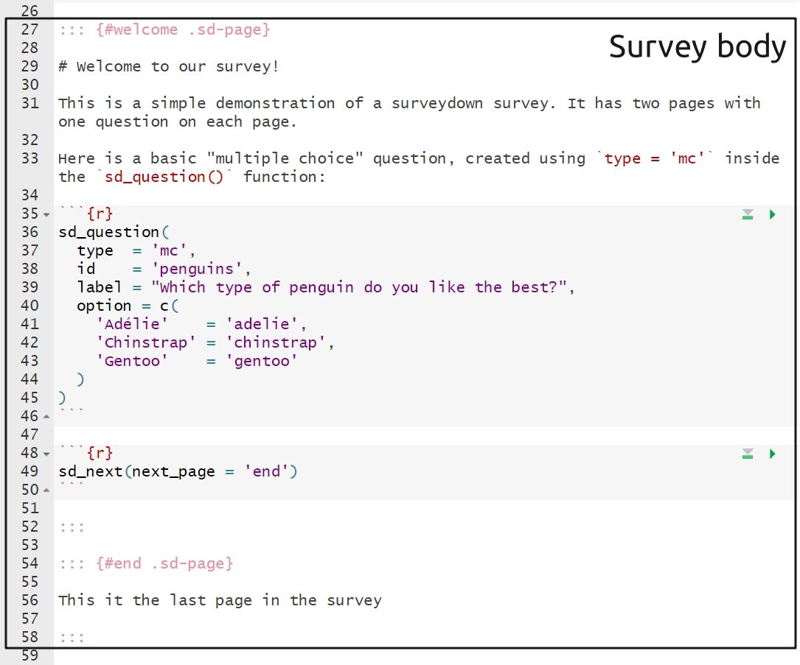
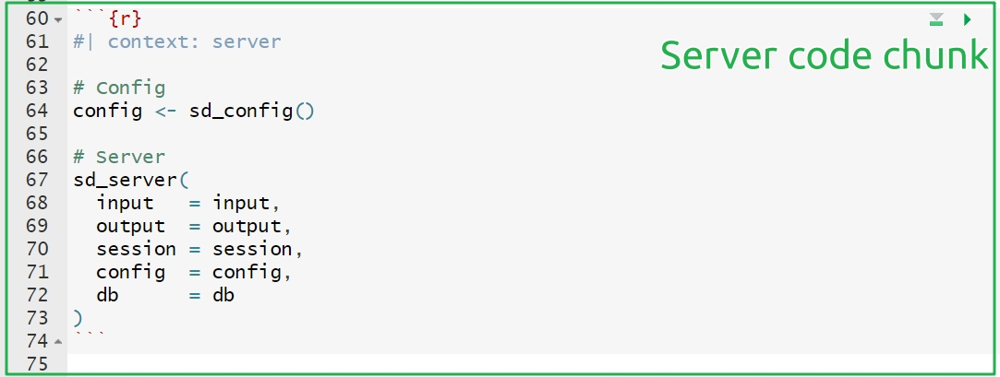
</center>

]

---

## 1. YAML Header

The YAML header is at the top of the `.qmd` file. 

**Must contain at least the following**:

``` yaml
---
server: shiny
filters: [surveydown]
---
```

--

Update / install the extension:

```{r}
#| eval: false

surveydown::sd_update_extension()
```

---

## Change the survey theme 

.leftcol[

Pick a different [bootswatch theme](https://bootswatch.com) with the `theme` key:

``` yaml
---
theme: united 
---
```

]

.rightcol[

Make a custom theme with a `custom.scss` file

``` yaml
---
theme: [united, custom.scss]
---
```

]

---

## Progress bar

You can modify the survey progress bar with the `barcolor` and `barposition` keys:

.leftcol[

Change to any color with `barcolor`:

``` yaml
---
barcolor: #768692 
---
```

]

.rightcol[

Change position: `top`, `bottom`, or `none`

``` yaml
---
barposition: bottom
---
```

]

---

.leftcol[

## 2. Setup code chunk

First chunk:

- Load libraries 
- Connect to database

Ignore this for now:

`ignore = TRUE`

]

.rightcol[

````markdown
`r ''````{r}
#| echo: fenced
#| context: setup
#| warning: false
#| message: false

# Load the package
library(surveydown)

# Load an other packages here

# Run initial setup function (essential - do not delete)
sd_setup()

# Setup database connection
db <- sd_database(
  host   = "",
  dbname = "",
  port   = "",
  user   = "",
  table  = "",
  ignore = TRUE
)
```
````

]

---

## 3. Survey body

This is where you insert pages, text, images, questions, etc.

---

# Inserting pages

Insert new pages with `:::` symbols, like this

```{r}
#| eval: false

::: {#page_name .sd-page}

Page content here

:::
```

--

Insert next buttons with the `sd_next()` function, like this

````markdown
`r ''````{r}
sd_next('next_page_name')
```
````

---

# Inserting questions

Insert questions using the `sd_question()` function, like this:

.leftcol[

**Code**

```{r}
#| eval: false

sd_question(
  type   = 'mc',
  id     = 'fruit',
  label  = "1. Do you like fruit?",
  option = c(
    'Yes!'    = 'yes',
    'Kind of' = 'kind_of',
    'No :('   = 'no'
  )
)
```

]

.rightcol[

**Output**

```{r}
#| echo: false

sd_question(
  type   = 'mc',
  id     = 'fruit',
  label  = "1. Do you like fruit?",
  option = c(
    'Yes!'    = 'yes',
    'Kind of' = 'kind_of',
    'No :('   = 'no'
  )
)
```

]

---

## surveydown supports lots of [question types](https://surveydown.org/question-types)

Some common types you may want to use:

Type | Description
-----|---------------------
`mc` | Multiple choice question (single choice) 
`mc_multiple` | Multiple choice question (multiple choices) 
`mc_buttons` | Multiple choice question (large buttons)
`select` | Drop down menu (choose one)
`text` | Open text, single row
`textarea` | Open text, block

---

# Embedding images

I recommend just writing html code, like this

```{html, eval=FALSE}

```


---

# Centered image

I recommend just writing html code, like this

```{html, eval=FALSE}
<center>

</center>
```

<center>

</center>

---

# The server code chunk

- Set up custom configurations, like skip logic.
- Launch the main server (`sd_server()` function).

---

# Enabling conditional actions

Use the `sd_config()` function to add conditional actions, like conditionally _showing_ something or conditionally _skipping_ to a page.

This is in the server code chunk of `demoSurvey.qmd`

```{r}
#| eval: false

config <- sd_config(
  skip_if = tibble::tribble(
    ~question_id, ~question_value, ~target, 
    'pill_color', 'blue',          'end'
  ), 
  show_if = tibble::tribble(
    ~question_id, ~question_value, ~target, 
    'fruit',      'yes',          'fav_fruit', 
    'fruit',      'kind_of',      'fav_fruit'
  ), 
)
```

---

## Conditional skipping

If they choose "Blue", skip to the end page

```{r}
#| eval: false

config <- sd_config(
  skip_if = tibble::tribble( #<<
    ~question_id, ~question_value, ~target, #<<
    'pill_color', 'blue',          'end'#<<
  ), #<<
  show_if = tibble::tribble(
    ~question_id, ~question_value, ~target, 
    'fruit',      'yes',          'fav_fruit', 
    'fruit',      'kind_of',      'fav_fruit'
  ), 
)
```

---

## Conditional showing

The "What's your favorite fruit" question will only be shown if they choose "Yes" or "Kind of" for the "Do you like fruit" question

```{r}
#| eval: false

config <- sd_config(
  skip_if = tibble::tribble(
    ~question_id, ~question_value, ~target, 
    'pill_color', 'blue',          'end'
  ), 
  show_if = tibble::tribble( #<<
    ~question_id, ~question_value, ~target, #<<
    'fruit',      'yes',          'fav_fruit', #<< 
    'fruit',      'kind_of',      'fav_fruit' #<<
  ), #<<
)
```

---

class: inverse

```{r, echo=FALSE}
countdown(
  minutes   = 15,
  top       = 0,
  right     = 0,
  font_size = '2em'
)
```

## Your turn

- Open and edit the `practiceSurvey.qmd` file.
- Pick a topic for your survey (a food, an animal, a sports team...whatever).
- Draft a survey about that topic. Include the following:
    - Page 1: A welcome message in large font ("Welcome to a survey about [topic]") and an image about the topic (find an image somewhere).
    - Page 2: Add one simple multiple choice question about the topic and another that will only display depending on a specific choice in the first question
    - Pages 3 & 4: These pages should be two different "end" conditions. Respondents should be sent to either page based on their choices in the multiple choice question on page 2.
    
---

```{r child="topics/2.Rmd"}
```

---

## Store data in [Supabase](https://supabase.com/)

Steps to connect a database via Supabase:

1. Create a Supabase account
2. Create a Supabase project
3. Copy your credentials

---

## Creating a project

.leftcol[

<center>
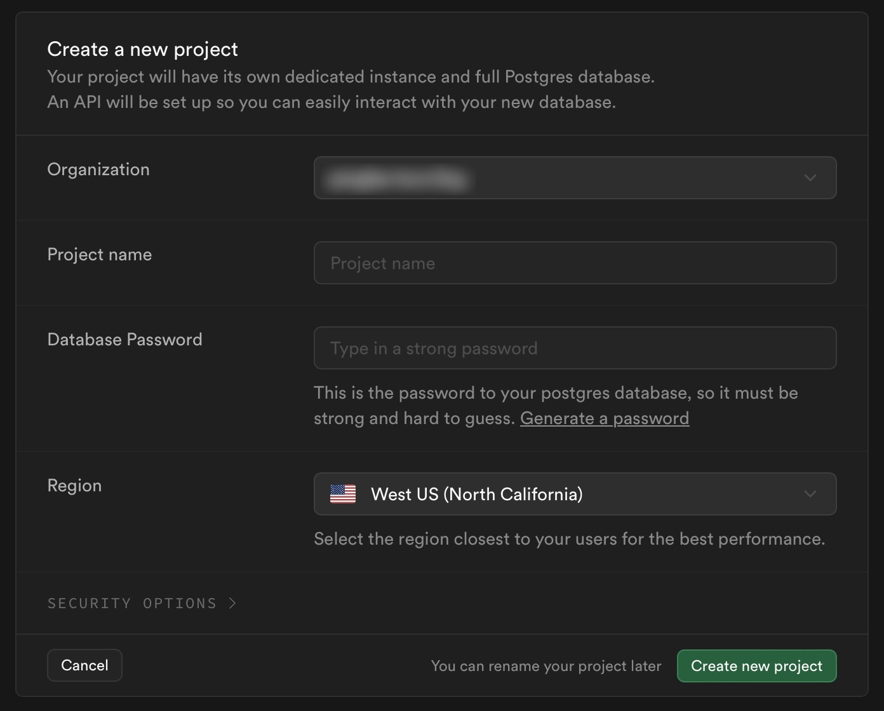
</center>

]

.rightcol[

- Choose a project name (this is your "database")
- Each database can have multiple tables
- Choose a strong password

]

---

## Set a password with `sd_set_password()`

To access your database from R, you need to securely store your Supabase password.

Do this in your R console like this:

```{r}
#| eval: false

sd_set_password("my_password")
```

--

This creates a `.Renvion` file in your project directory where your password lives. **Don't modify this file!**

```
SURVEYDOWN_PASSWORD=my_password
```

---

## Copy your credentials

.leftcol[

Go to **Project Settings** in bottom-left corner, then click **Database** under **Configuration**

Get your **Connection parameters**:

<center>
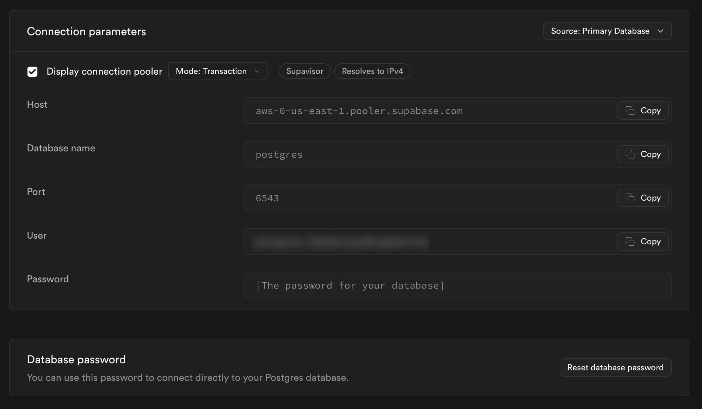
</center>

]

.rightcol[

- Put them in your server code chunk.
- Choose any table name you want to store your data.

```{r}
#| eval: false

db <- sd_database(
  host   = "",
  dbname = "",
  port   = "",
  user   = "",
  table  = "any_table_name"
)
```

]

---

class: inverse

```{r, echo=FALSE}
countdown(
  minutes   = 10,
  top       = 0,
  right     = 0,
  font_size = '2em'
)
```

## Your turn

- Create a Supabase account and database
- Copy your parameters into your `practiceSurvey.qmd` file.
- Click "Run Document" and check that the database table is updating in your Supabase table.

---

class: inverse, center

# .fancy[Break]

```{r, echo=FALSE}
countdown(
    minutes   = 5,
    left      = 0, right = 0, top = 1, bottom = 0,
    margin    = "5%",
    font_size = "8em"
)
```

---

```{r child="topics/3.Rmd"}
```

---

class: middle, center

# Follow [instructions](https://surveydown.org/deployment) on surveydown.org

---

```{r child="topics/4.Rmd"}
```

---

# 3 Parts

<br>

- ### **Part 1**: Intro
- ### **Part 2**: Conjoint questions
- ### **Part 3**: Other / demographic questions

---

# 3 Parts

<br>

- ### **Part 1**: Intro --> .red[screen for target population]
- ### **Part 2**: Conjoint questions --> .red[screen for random answers]
- ### **Part 3**: Other / demographic questions

---

# .center[Think of your survey as a _conversation_]

<br>

- Include "transition" pages (e.g. Great job! Now we'll ask you about...) 

---

class: middle, center, inverse

# **Part 1**: Intro

---

class: center

# Start with a welcome page

<center>

</center>

---

class: center, middle

.leftcol30[

# Consent form

]

.rightcol70[

<center>
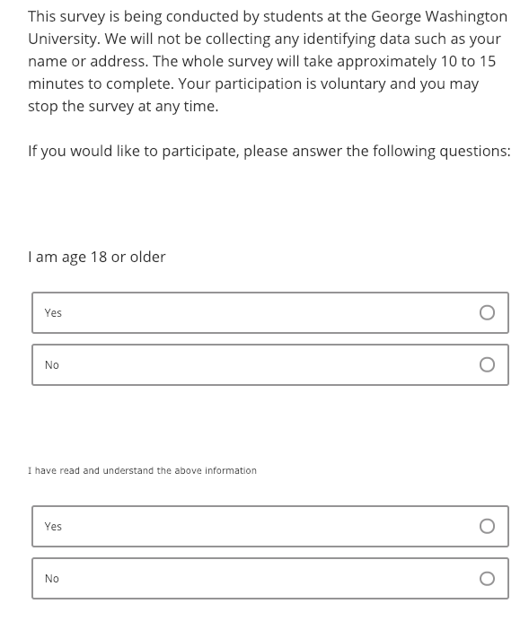
</center>

]

---

class: center

## **Eligibility questions**: who is your target population?

### .red[_Filter out respondents here_]

<center>
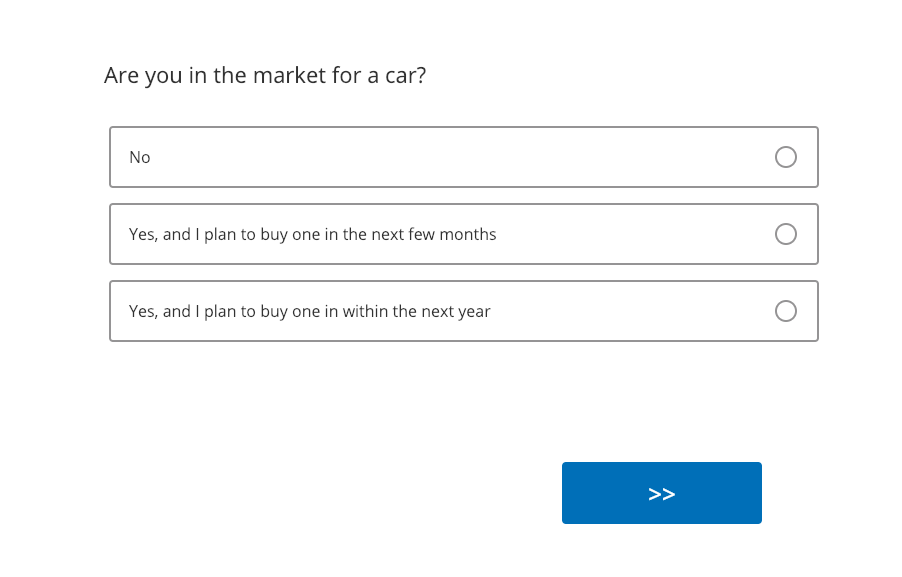
</center>

---

class: middle, center, inverse

# **Part 2**: Conjoint questions

---

class: middle, center

# Education information

<center>
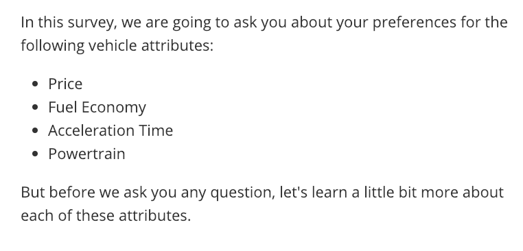
</center>

---

class: center

# Education information

.leftcol[

<center>
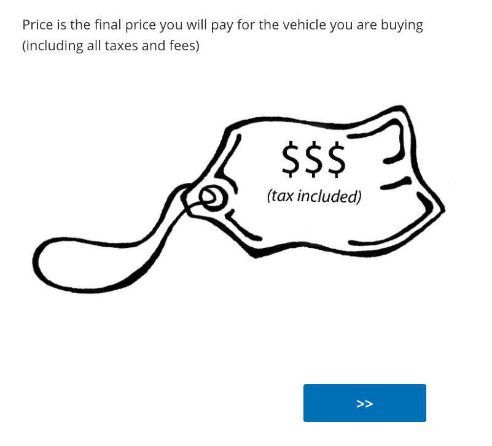
</center>

]

.rightcol[

<center>
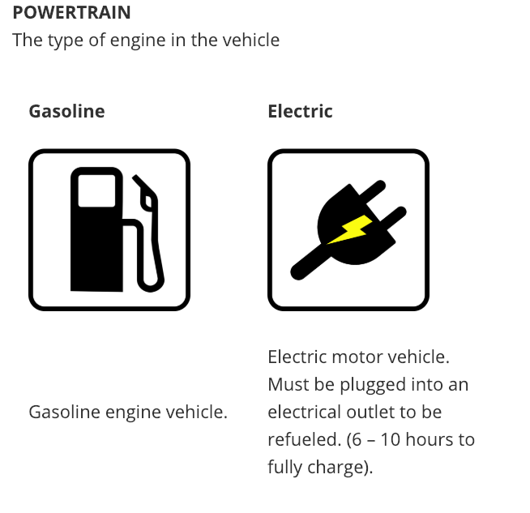
</center>

]

---

## .center[Can be helpful to provide relative comparisons]

Weight: 

- 1/2 lbs (similar to 1 cup water)
- 8 lbs (similar to 1 gallon of milk)

---

class: center

# Conjoint intro

<center>
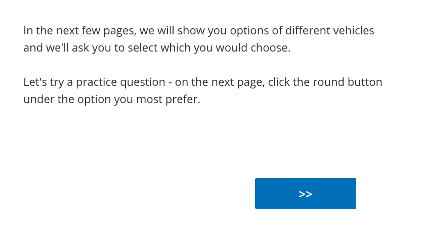
</center>

---

class: center

## Practice conjoint (also attention check)

### .red[_May also filter out respondents here_]

<center>
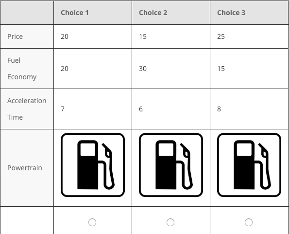
</center>

---

class: center

# Transition to actual conjoint questions

<center>
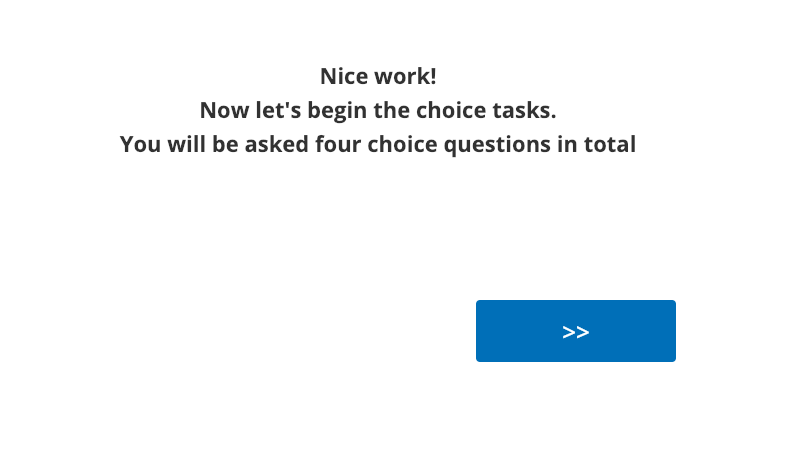
</center>

---

class: middle 

.leftcol40[

# Conjoint questions

### .red[_May also filter out respondents at the end_]

(e.g. chose all same answers)

]

.rightcol60[

<center>
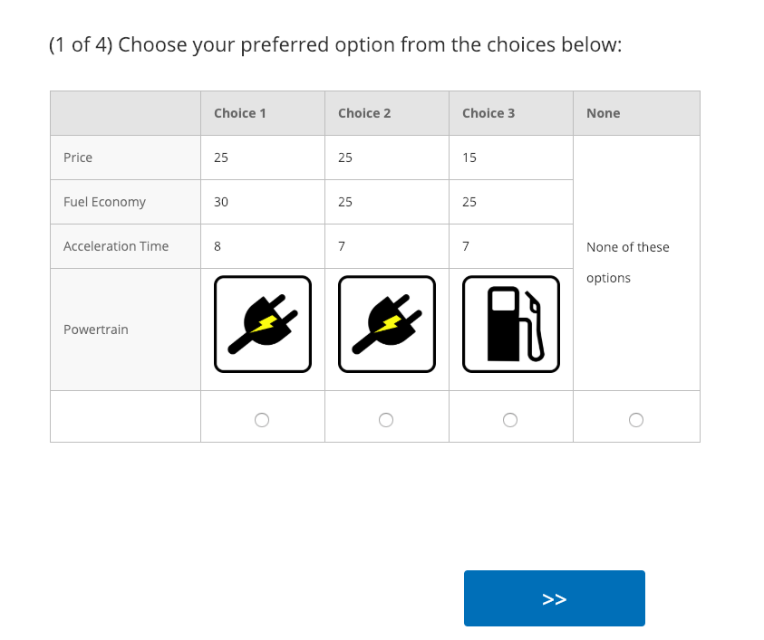
</center>

]

---

class: middle, center, inverse

# **Part 3**: Other / demographic questions

---

class: center

# Transition

<center>
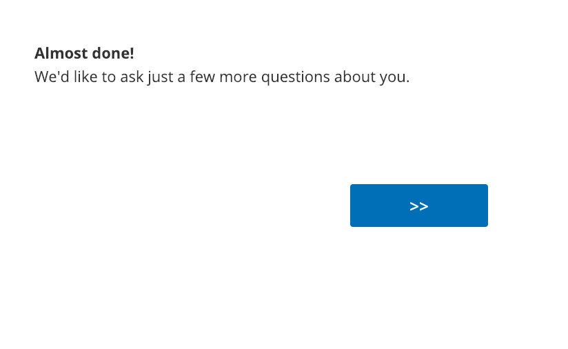
</center>

---

class: center

# Critical respondent information 

<center>
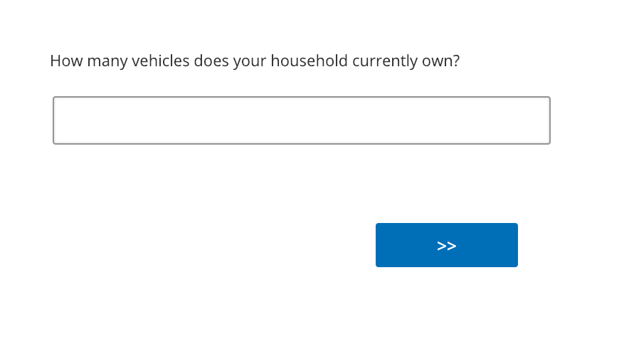
</center>

---

class: center
 
# Demographic / other questions
 
<center>
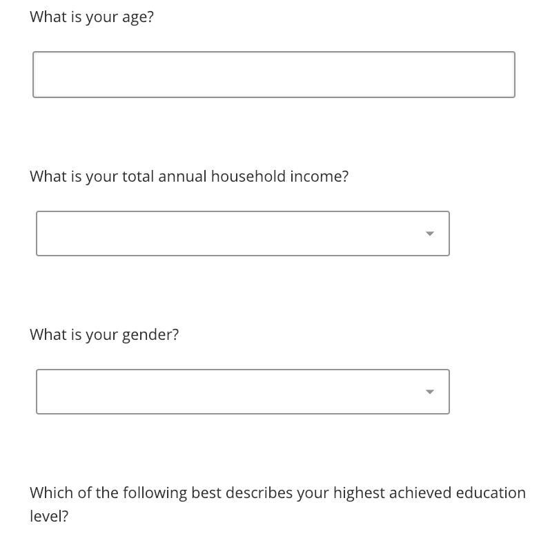
</center>

---

class: center

# Finale

<center>
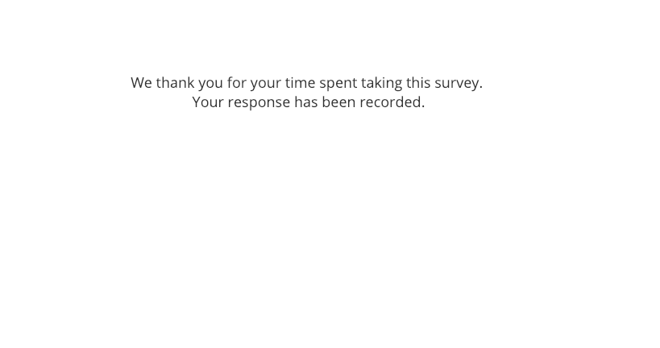
</center>

---

class: inverse, center, middle

# [Blog post on conjoint in surveydown](https://surveydown.org/blog/2024-08-28-choice-based-conjoint-surveys-with-surveydown/)

--

# [Project survey plan](https://madd.seas.gwu.edu/2024-Fall/project/2-survey-plan.html)

--

# Sign up for meeting slot next week<br>(link in #project channel)

