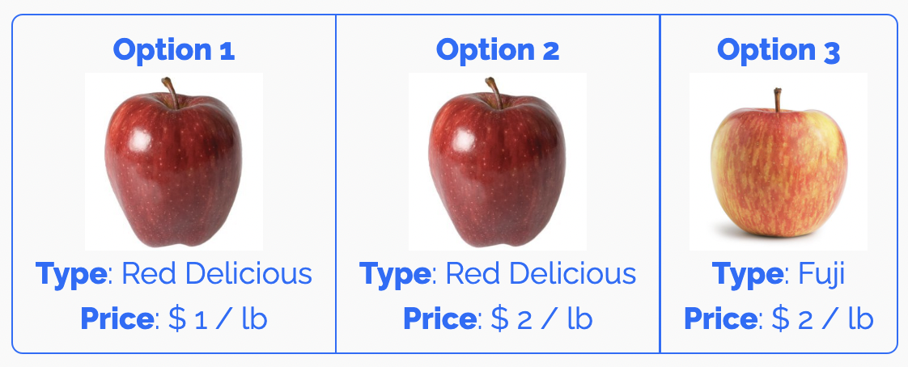
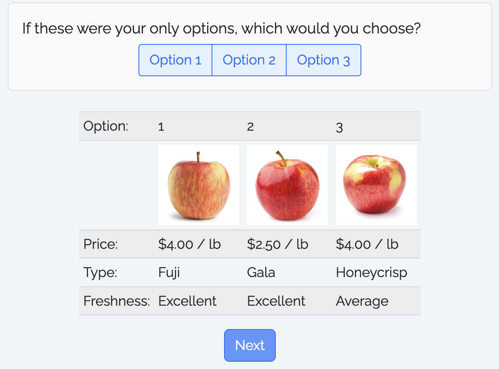

```{r setup, child="../setup.Rmd"}
```

```{r}
#| include: false

library(cbcTools)
library(surveydown)
library(glue)
set.seed(123)

# Define profiles with attributes and levels
profiles <- cbc_profiles(
    price       = c(15, 20, 25), # Price ($1,000)
    fuelEconomy = c(20, 25, 30), # Fuel economy (mpg)
    accelTime   = c(6, 7, 8),    # 0-60 mph acceleration time (s)
    powertrain  = c("Gasoline", "Electric")
)
# Make a full-factorial design of experiment
design <- cbc_design(
    profiles = profiles,
    n_resp   = 500, # Number of respondents
    n_alts   = 3,   # Number of alternatives per question
    n_q      = 8    # Number of questions per respondent
)
# Make a labeled full-factorial design of experiment
design_labeled <- cbc_design(
    profiles = profiles,
    n_resp   = 500, # Number of respondents
    n_alts   = 2,   # Number of alternatives per question
    n_q      = 8,   # Number of questions per respondent
    label    = "powertrain"
)
# Make a survey with no choice option
design_nochoice <- cbc_design(
    profiles = profiles,
    n_resp   = 500, # Number of respondents
    n_alts   = 3,   # Number of alternatives per question
    n_q      = 8,   # Number of questions per respondent
    no_choice = TRUE
)

design_short <- design %>%
  mutate(
    price = scales::dollar(price),
    fuelEconomy = paste0(fuelEconomy, " (mpg)"),
    accelTime = paste0(accelTime, " (s)")
  ) %>% 
  select(
    respID, qID,
    `Option:` = altID, 
    `Price:` = price, 
    `Fuel Economy:` = fuelEconomy, 
    `Accel. Time:` = accelTime, 
    `Powertrain:` = powertrain
  )
design_labeled_short <- design_labeled %>%
  mutate(
    price = scales::dollar(price),
    fuelEconomy = paste0(fuelEconomy, " (mpg)"),
    accelTime = paste0(accelTime, " (s)")
  ) %>% 
  select(
    respID, qID,
    `Option:` = powertrain, 
    `Price:` = price, 
    `Fuel Economy:` = fuelEconomy, 
    `Accel. Time:` = accelTime
  )
design_nochoice_short <- design_nochoice %>%
  mutate(
    price = scales::dollar(price),
    fuelEconomy = paste0(fuelEconomy, " (mpg)"),
    accelTime = paste0(accelTime, " (s)"),
    price = ifelse(altID == 4, "", price),
    fuelEconomy = ifelse(altID == 4, "", fuelEconomy),
    accelTime = ifelse(altID == 4, "", accelTime),
    powertrain = ifelse(powertrain_Electric == 1, "Electric", "Gasoline"),
    powertrain = ifelse(altID == 4, "", powertrain),
    altID = ifelse(altID == 4, "None", altID)
  ) %>% 
  select(
    respID, qID,
    `Option:` = altID, 
    `Price:` = price, 
    `Fuel Economy:` = fuelEconomy, 
    `Accel. Time:` = accelTime, 
    `Powertrain:` = powertrain
  )
row.names(design_nochoice_short) <- seq(nrow(design_nochoice_short))
design_q1 <- design_short %>%
  filter(respID == 1, qID == 1) %>% 
  select(-respID, -qID)
design_q2 <- design_short %>%
  filter(respID == 1, qID == 2) %>% 
  select(-respID, -qID)
design_labeled_q1 <- design_labeled_short %>%
  filter(respID == 1, qID == 1) %>% 
  select(-respID, -qID)
design_labeled_q2 <- design_labeled_short %>%
  filter(respID == 1, qID == 2) %>% 
  select(-respID, -qID)
design_nochoice_q1 <- design_nochoice_short %>%
  filter(respID == 1, qID == 1) %>% 
  select(-respID, -qID)
design_nochoice_q2 <- design_nochoice_short %>%
  filter(respID == 1, qID == 2) %>% 
  select(-respID, -qID)
```

---

class: inverse, middle, center

# Some Quarto tips

---

### .center[Convert a data frame to a markdown table with `kable()`]

--

```{r, eval=FALSE}
library(tidyverse)

mtcars %>% 
  kable()
```

--

.font80[

```{r, echo=FALSE}
mtcars %>% 
  kable()
```

]

---

### .center[Example from last year]

```{r, eval=FALSE}
library(tidyverse)
library(here)

df <- read_csv(here("data", "competitors.csv"))
df %>% 
  kable()
```

.font80[

```{r, echo=FALSE}
library(tidyverse)
library(here)

df <- read_csv(here("data", "competitors.csv"))
df %>% 
  kable()
```

]

---

class: center, middle 

# More `kable()` formatting options:<br>[{kableExtra} package](https://cran.r-project.org/web/packages/kableExtra/vignettes/awesome_table_in_html.html)

---

# References

**Simple approach**: Insert a footnote with `^[]` 

.leftcol[

### This markdown...

`The Eiffel Tower is 324 meters tall^[From the [Eiffel Tower wikipedia page](https://en.wikipedia.org/wiki`<br>`/Eiffel_Tower)]`

]

.rightcol[

### ...renders as this

The Eiffel Tower is 324 meters tall<sup>1</sup>

.font70[<sup>1</sup>From the [Eiffel Tower wikipedia page](https://en.wikipedia.org/wiki/Eiffel_Tower)]

]

---

# References

**Complex (but more complete) approach**: Use bibtex 

https://quarto.org/docs/authoring/footnotes-and-citations.html

You can insert citations with `[@citekey]`, and a "References" table will be automatically created.

--

<br>

**Footnotes are perfectly fine for this class**

---

class: inverse

# Quiz 2

```{r, echo=FALSE}
countdown(
    minutes = 10,
    warn_when = 30,
    update_every = 1,
    bottom = 0,
    left = 0,
    font_size = '4em'
)
```

.leftcol[

### Download the template from the #class channel

### Make sure you unzip it!

### When done, submit your `quiz2.qmd` on Blackboard

]

.rightcol[

<center>

</center>

]

---

```{r child="topics/0.Rmd"}
```

---

```{r child="topics/1.Rmd"}
```

---

## Download & unzip two repos:

## - [logitr-cars](https://github.com/jhelvy/logitr-cars/archive/refs/heads/main.zip) 

## - [demo-choice-based-conjoint](https://github.com/surveydown-dev/demo-choice-based-conjoint/archive/refs/heads/main.zip)

(code used in the [blog post](https://surveydown.org/blog/2024-08-28-choice-based-conjoint-surveys-with-surveydown/) on conjoint in surveydown)

---

class: middle, inverse, center

# Open `logitr-cars.Rproj`

---

## .center[We'll be using the [{cbcTools} package](https://jhelvy.github.io/cbcTools/) today]

```{r, eval=FALSE}
install.packages("cbcTools")
```

---

# Choice question components

### 1. Generate `profiles` for each attribute and level

### 2. Create a survey `design` data frame from `profiles`

---

class: center 

# Basic Design

Any combination of attributes can be shown in each choice question

.leftcol[.font90[

## Question 1

```{r, echo=FALSE}
kable(t(design_q1))
```

]]

.rightcol[.font90[

## Question 2

```{r, echo=FALSE}
kable(t(design_q2))
```

]]

---

class: center 

# Labeled Design

One attribute is used as the "label" - choice options are fixed according to the label

.leftcol[.font90[

## Question 1

```{r, echo=FALSE}
kable(t(design_labeled_q1))
```

]]

.rightcol[.font90[

## Question 2

```{r, echo=FALSE}
kable(t(design_labeled_q2))
```

]]

---

class: center

# Design with a "None" option

A "none" option means they can choose an "other" option

.leftcol[.font90[

## Question 1

```{r, echo=FALSE}
kable(t(design_nochoice_q1))
```

]]

.rightcol[.font90[

## Question 2

```{r, echo=FALSE}
kable(t(design_nochoice_q2))
```

]]

---

# Attribute-specific features

Some attributes may only be valid for certain levels of other attributes

> **Example**: The driving range of an electric vehicle (EV) only applies to EVs and not gasoline-powered vehicles.

--

<br>

To implement this, edit `profiles` prior to using `cbc_design()`

(see `logitr-cars` code 1.2)

---

# Restricted profiles

Sometimes you may want to not allow a specific combination of features  -  use `cbc_restrict()` to implement this 

(see `logitr-cars` code 1.3)

--

<br> 

# .red[Warning]: Avoid restrictions if possible!

---

class: inverse

```{r, echo=FALSE}
countdown(
  minutes = 20,
  warn_when = 15,
  update_every = 1,
  top = 0,
  right = 0,
  font_size = '2em'
)
```

## Your Turn

## Open `survey.Rproj` in "demo-choice-based-conjoint"

With your team, discuss the specific choice question design for your project

- Regular or labeled?
- Include a "none" option (outside good) or not?
- Include restrictions?

Edit the `make-choice-questions.R` file to design your choice questions.

---

```{r child="topics/2.Rmd"}
```

---

# .center[Displaying choice questions in your survey]

### 1. Read in the design file (`choice_questions.csv`)
### 2. Sample and store a random respondent ID
### 3. Filter the design for the respondentID
### 4. Define a function to create question options
### 5. Create the options for each choice question
### 6. Create each choice question (6 in total)

---

### 1. Read in the design file (`choice_questions.csv`)

```{r}
design <- readr::read_csv("choice_questions.csv")
```

---

### 2. Sample and store a random respondent ID

Sample a random respondentID

```{r}
respondentID <- sample(design$respID, 1)
```

Store the respondentID

```{r}
#| eval: false

sd_store_value(respondentID, "respID")
```

In your survey data, you will have a `respID` column

---

### 3. Filter the design for the respondentID

```{r}
df <- design %>%
  filter(respID == respondentID) %>%
  mutate(image = paste0("images/", image))
```

Images are stored in `"images"` folder, so we paste on that path

--

Result looks like this:

```{r}
head(df)
```

---

.leftcol[

### 4. Define a function to create question options

]

.rightcol[.code70[

```{r}
make_cbc_options <- function(df) {
  alt1 <- df |> filter(altID == 1)
  alt2 <- df |> filter(altID == 2)
  alt3 <- df |> filter(altID == 3)

  options <- c("option_1", "option_2", "option_3")

  names(options) <- c(
    glue("
      **Option 1**<br>
      <br>
      **Type**: {alt1$type}<br>
      **Price**: $ {alt1$price} / lb
    "),
    glue("
      **Option 2**<br>
      <br>
      **Type**: {alt2$type}<br>
      **Price**: $ {alt2$price} / lb
    "),
    glue("
      **Option 3**<br>
      <br>
      **Type**: {alt3$type}<br>
      **Price**: $ {alt3$price} / lb
    ")
  )
  return(options)
}
```

]]

---

.leftcol[

### 4. Define a function to create question options

Make one-row data frames for each alternative.

For example, `alt1` looks like this:

```{r}
#| echo: false

alt1 <- df %>% 
  filter(qID == 1) %>% 
  filter(altID == 1)

glimpse(alt1)
```

]

.rightcol[.code70[

```{r}
#| eval: false

make_cbc_options <- function(df) {
  alt1 <- df |> filter(altID == 1) #<<
  alt2 <- df |> filter(altID == 2) #<<
  alt3 <- df |> filter(altID == 3) #<<

  options <- c("option_1", "option_2", "option_3")

  names(options) <- c(
    glue("
      **Option 1**<br>
      <br>
      **Type**: {alt1$type}<br>
      **Price**: $ {alt1$price} / lb
    "),
    glue("
      **Option 2**<br>
      <br>
      **Type**: {alt2$type}<br>
      **Price**: $ {alt2$price} / lb
    "),
    glue("
      **Option 3**<br>
      <br>
      **Type**: {alt3$type}<br>
      **Price**: $ {alt3$price} / lb
    ")
  )
  return(options)
}
```

]]

---

.leftcol[

### 4. Define a function to create question options

```{r}
alt1[c('image', 'type', 'price')]
```

Highlighted section renders as:

```{r}
#| echo: false

cat(glue("
  **Option 1**<br>
  <br>
  **Type**: {alt1$type}<br>
  **Price**: $ {alt1$price} / lb
"))
```

]

.rightcol[.code70[

```{r}
#| eval: false

make_cbc_options <- function(df) {
  alt1 <- df |> filter(altID == 1)
  alt2 <- df |> filter(altID == 2)
  alt3 <- df |> filter(altID == 3)

  options <- c("option_1", "option_2", "option_3")

  names(options) <- c(
    glue("  #<<
      **Option 1**<br>  #<<
      <br>  #<<
      **Type**: {alt1$type}<br>  #<<
      **Price**: $ {alt1$price} / lb  #<<
    "),  #<<
    glue("
      **Option 2**<br>
      <br>
      **Type**: {alt2$type}<br>
      **Price**: $ {alt2$price} / lb
    "),
    glue("
      **Option 3**<br>
      <br>
      **Type**: {alt3$type}<br>
      **Price**: $ {alt3$price} / lb
    ")
  )
  return(options)
}
```

]]

---

### 5. Create the options for each choice question

```{r}
cbc1_options <- make_cbc_options(df |> filter(qID == 1))
```

Value stored in your data: 

```{r}
#| echo: false

cat(cbc1_options[1])
```

.leftcol[

Label:

```{r}
#| echo: false

names(cbc1_options[1])
```

]

.rightcol[

Renders as:

```{r}
#| echo: false

htmltools::HTML(names(cbc1_options[1]))
```

]

---

### 5. Create the options for each choice question

Now make the options for each question

```{r}
cbc1_options <- make_cbc_options(df |> filter(qID == 1))
cbc2_options <- make_cbc_options(df |> filter(qID == 2))
cbc3_options <- make_cbc_options(df |> filter(qID == 3))
cbc4_options <- make_cbc_options(df |> filter(qID == 4))
cbc5_options <- make_cbc_options(df |> filter(qID == 5))
cbc6_options <- make_cbc_options(df |> filter(qID == 6))
```

---

### 6. Create each choice question (6 in total)

.leftcol[

Code:

```{r}
#| eval: false

sd_question(
  type   = 'mc_buttons',
  id     = 'cbc_q1',
  label  = "(1 of 6) If these were your only options, which would you choose?",
  option = cbc1_options
)
```

]

.rightcol[

Renders as:

<center>

</center>

]

---

## .center[TABLE layout: Show options in a table with `kable()`]

```{r}
library(dplyr)

alts <- df %>%
  filter(qID == 1) %>% 
  mutate(
    # Add $ sign to price and html code for image path
    price = paste(scales::dollar(price), "/ lb"),
    image = paste0('')) %>%
  # Make nicer attribute labels
  select(
    `Option:`    = altID,
    ` `          = image,
    `Price:`     = price,
    `Type:`      = type,
    `Freshness:` = freshness)

# Drop row names
row.names(alts) <- NULL
```

---

## .center[Option: Show options in a table with `kable()`]

Display the _transpose_, `t(alts)`

```{r}
kbl(t(alts), escape = FALSE) %>%
  kable_styling(
    bootstrap_options = c("striped", "hover", "condensed"),
    full_width = FALSE,
    position = "center"
  )
```

---

class: center 

## .center[TABLE layout: Show options in a table with `kable()`]

Your choice question can be defined in the `survey.qmd`<br>file as it is just choosing one of three options:

<center>

</center>

---

class: inverse

```{r, echo=FALSE}
countdown(
    minutes = 20,
    warn_when = 15,
    update_every = 1,
    top = 0,
    right = 0,
    font_size = '2em'
)
```

## Your Turn

With your team, choose a format to work with (buttons or table) for your choice question, then modify the example survey to match your project.

## Versions:

## Buttons layout: [demo-choice-based-conjoint](https://github.com/surveydown-dev/demo-choice-based-conjoint/archive/refs/heads/main.zip)

## Table layout: [demo-choice-based-conjoint-table](https://github.com/surveydown-dev/demo-choice-based-conjoint-table/archive/refs/heads/main.zip)
